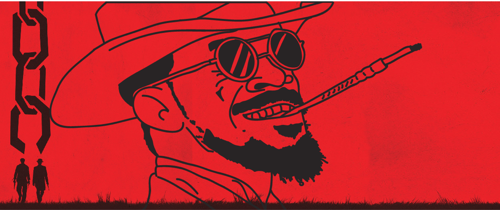

Image (c) [Callum Wilkins / deviant art](http://callumwilkins.deviantart.com/art/Django-Unchained-Wallpaper-391966509)

# Testing Unchained
Quelltexte und Folien für den Vortrag "Testing Unchained" auf der Developer Week 2016

## Installation
```bash
npm install
```

## Wikipedia Mock starten
```bash
cd wikipedia-mock
sudo npm start
```

## Jasmine
```bash
npm run jasmine
```

Tests in: [spec/some-class-spec.js](spec/some-class-spec.js)

## CasperJS
```bash
npm rum casper
```

Tests in [casper-tests/wikipedia-test.js](casper-tests/wikipedia-test.js)

## cucumber.js
```bash
npm run cucumber
```

Tests in:
- [features/wikipedia-einfach.feature](features/wikipedia-einfach.feature)
- [features/wikipedia-extended.feature](features/wikipedia-extended.feature)
- [features/step_definitions/wikipedia_steps.js](features/step_definitions/wikipedia_steps.js)

## Folien
[pdf/Testing unchained.pdf](pdf/Testing%20unchained.pdf)

## Links
- [Jasmine](http://jasmine.github.io/)
- [CasperJS](http://casperjs.org/)
- [cucumber.js](https://github.com/cucumber/cucumber-js)